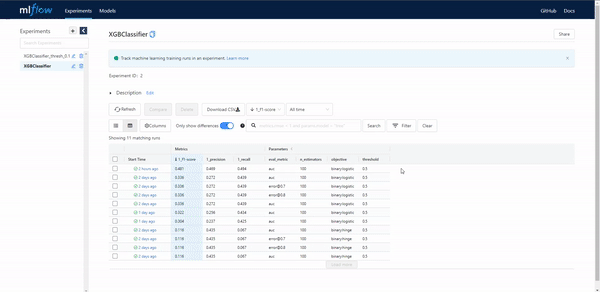

# Crypto Trend Prediction Algorithm
This is an MLflow integrated pipeline built by using Ploomber framework. Upon providing the required list of parameters, the input data will be processed and fed into the XGBoost Classifier which will be trained to predict in binary sense whether a given set of financials is neutral or bullish/bearish (e.g., it has reached the local maxima or minima). 

The code itself can download the requested Crypto through using binance client (of which you'll need an API key provided in a keys.yaml file). This project in on development phase. Hopefully I will be fixing some bugs and adding the multiclass version of the work.

__**DISCLAIMER: This algorithm is built for learning purposes and it's NOT advised to use it on live trading**__

## Quick Setup

```sh
# NOTE: if running ploomber <0.16, remove the --create-env argument
ploomber install --create-env
# activate conda environment
conda activate crypto-prediction-project

```


## Running the pipeline

```sh
ploomber build
```

## MLFlow View

